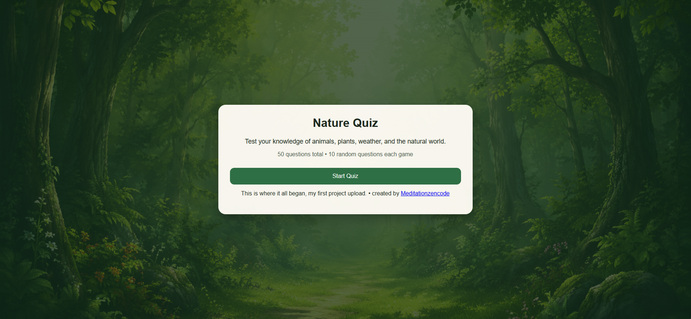
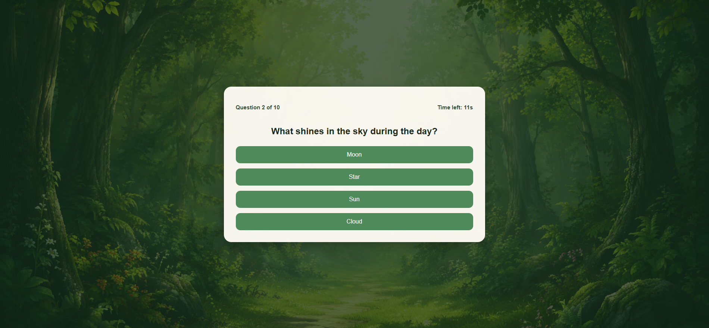
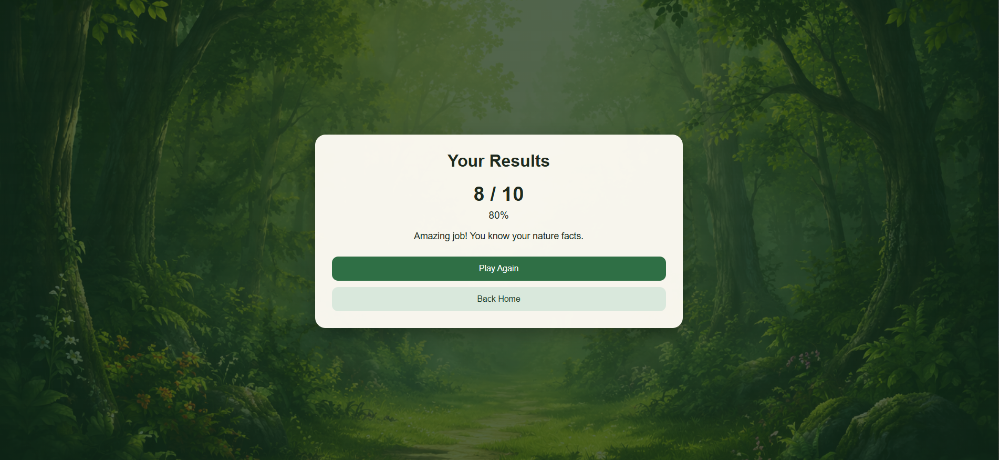

# Nature Quiz

A nature-themed quiz web app built with **Python** and **Flask**. Users answer 10 random multiple-choice questions from a bank of 200 nature questions across four categories: birds, trees, insects, and animals.

This was my first Flask project. The aim was to build a complete, polished beginner web app that demonstrates Flask routing, templates, session-based quiz logic, responsive design, and basic frontend interaction.

## Live Demo

[View the live project](https://nature-quiz.onrender.com)

## GitHub Repository

[View the GitHub repository](https://github.com/Meditationzencode/nature-quiz)

## Screenshots

### Home Page



### Quiz Page



### Results Page



## Overview

Nature Quiz is a Flask web application that tests users on their knowledge of the natural world. Each game randomly selects 10 questions from a larger question bank, making the quiz replayable and varied.

The project was built to practise core Flask concepts, including routing, templates, session-based state management, and dynamic quiz logic. It also includes a countdown timer and a responsive, nature-themed interface to make the app more engaging.

## Features

- Flask-based web application
- 200 nature-themed multiple-choice questions
- Four nature categories:
  - Birds
  - Trees
  - Insects
  - Animals
- 10 random questions per game
- Score tracking across a quiz session
- Instant answer feedback
- Final score and percentage results
- Countdown timer for each question
- Play Again flow for replayability
- Responsive layout for desktop and smaller screens
- Nature-themed visual design
- Custom 404 and 500 error pages
- Safe session validation and input handling

## Tech Stack

- Python
- Flask
- HTML
- CSS
- JavaScript

## Project Structure

```text
nature-quiz/
├─ app.py
├─ questions.py
├─ requirements.txt
├─ README.md
├─ .gitignore
├─ static/
│  ├─ style.css
│  └─ images/
└─ templates/
   ├─ layout.html
   ├─ index.html
   ├─ quiz.html
   ├─ result.html
   ├─ 404.html
   └─ 500.html
```

## How It Works

1. The user starts the quiz from the home page.
2. The application randomly selects 10 questions from the full question bank.
3. One question is shown at a time.
4. The user selects an answer before the timer runs out.
5. The app provides answer feedback and updates the score.
6. After the final question, the results page displays the total score and percentage.
7. The user can play again to start a new random quiz.

## Installation

### Clone the repository

```bash
git clone https://github.com/Meditationzencode/nature-quiz.git
cd nature-quiz
```

### Create and activate a virtual environment

Windows:

```bash
py -3 -m venv .venv
.venv\Scripts\activate
```

Mac/Linux:

```bash
python3 -m venv .venv
source .venv/bin/activate
```

### Install dependencies

```bash
pip install -r requirements.txt
```

If `requirements.txt` is not available, install Flask manually:

```bash
pip install Flask
```

## Run the Application Locally

```bash
python -m flask --app app run --debug
```

Then open:

```text
http://127.0.0.1:5000
```

## Environment Variables

The app loads environment variables from a `.env` file using `python-dotenv`. Copy `.env.example` to `.env` and set a real secret key before running locally.

```env
SECRET_KEY=your-secret-key-here
```

The `.env` file should not be committed to GitHub.

## Testing

Testing is a future improvement for this project.

Useful tests to add would include:

- Route tests for the home, quiz, and results pages
- Quiz logic tests for score calculation
- Session tests to check quiz progress
- Form/input tests for answer submission
- Error page tests

Example command once tests are added:

```bash
pytest
```

## Security Considerations

- No secret keys should be committed to GitHub.
- Environment variables should be used for sensitive settings.
- User input should be validated before being processed.
- Debug mode should not be enabled in production.
- Custom 404 and 500 error pages are included with nature-themed messaging.
- If an admin/question editing page is added later, it should be protected with authentication.

## Example Questions

- Which bird says "quack"?
- Which tree grows coconuts?
- Which insect glows at night?
- Which animal has a long trunk?
- Which bird is a symbol of peace?

## Skills Demonstrated

This project highlights:

- Python application development
- Flask routing
- Template rendering
- Session management
- Working with structured quiz data
- Dynamic quiz logic
- Frontend integration with HTML, CSS, and JavaScript
- Responsive web design
- Basic UI/UX design for an interactive web app
- GitHub project organisation

## What I Learned

While building this project, I learned how to:

- Structure a small Flask web application
- Use Flask routes to control page flow
- Render dynamic content using templates
- Track quiz progress using session data
- Build score calculation logic
- Add frontend interactivity with JavaScript
- Create a responsive layout for different screen sizes
- Document a project clearly for GitHub and portfolio use

## Future Improvements

- Add a high score table
- Add a simple admin page for adding and editing questions
- Add more screenshots, including a mobile screenshot
- Add a GIF showing the app in use

## Author

**Bradley**

GitHub: [https://github.com/Meditationzencode](https://github.com/Meditationzencode)
