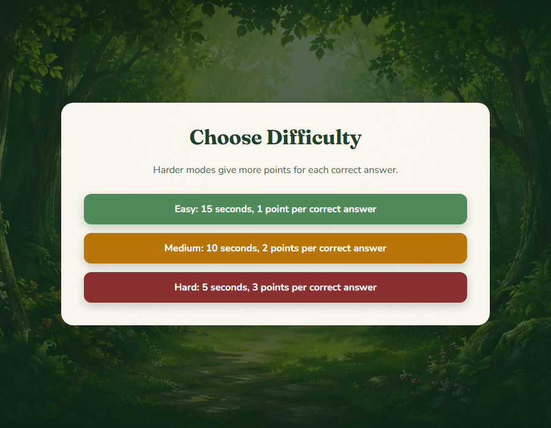
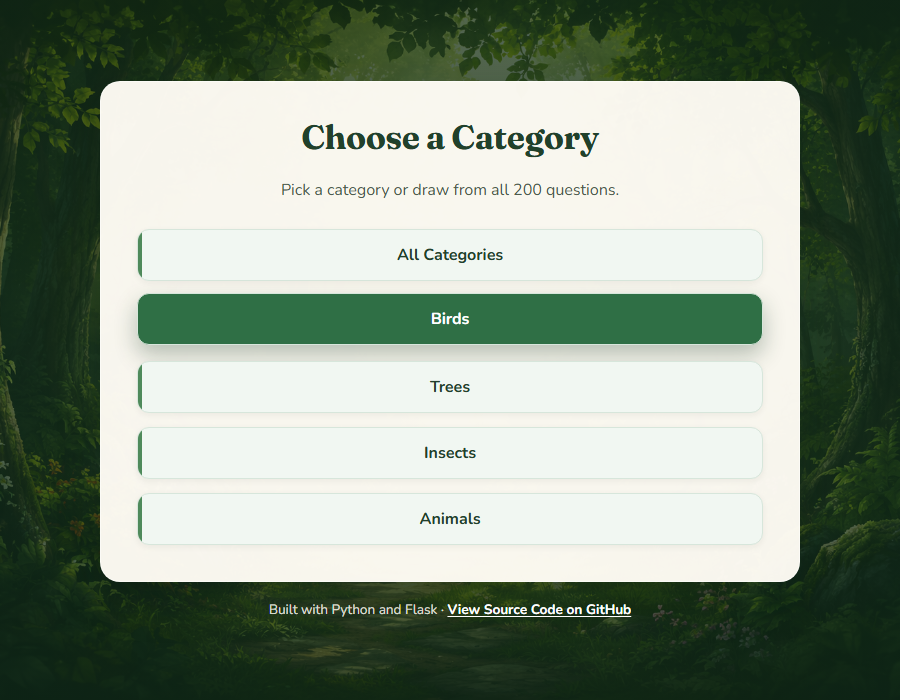
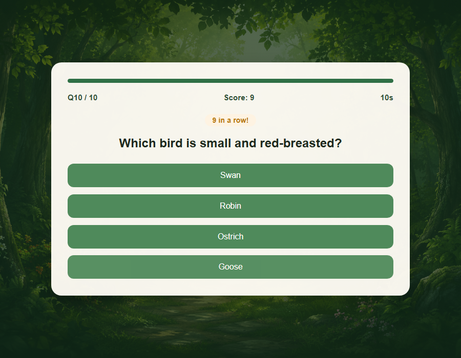

# Nature Quiz

A nature-themed quiz web app built with **Python** and **Flask**. Users answer 10 random multiple-choice questions from a bank of 200 nature questions across four categories: birds, trees, insects, and animals.

This was my first Flask project. The aim was to build a complete, polished beginner web app that demonstrates Flask routing, templates, session-based quiz logic, responsive design, and basic frontend interaction.

## Live Demo

[View the live project](https://nature-quiz.onrender.com)

## GitHub Repository

[View the GitHub repository](https://github.com/Meditationzencode/nature-quiz)

## Screenshots

### Home Page


### Choose Difficulty



### Choose Category



### Quiz Question


### Streak Counter



### Answer Feedback


### Mobile View


## Overview

Nature Quiz is a Flask web application that tests users on their knowledge of the natural world. Each game randomly selects 10 questions from a larger question bank, making the quiz replayable and varied.

The project was built to practise core Flask concepts, including routing, templates, session-based state management, and dynamic quiz logic. It also includes a countdown timer and a responsive, nature-themed interface to make the app more engaging.

## Features

- Flask-based web application
- 200 nature-themed multiple-choice questions
- Three difficulty levels:
  - Easy — 15 seconds per question
  - Medium — 10 seconds per question
  - Hard — 5 seconds per question
- Four nature categories:
  - Birds
  - Trees
  - Insects
  - Animals
- 10 random questions per game
- Score tracking across a quiz session
- Instant answer feedback with correct answer shown
- Time's up feedback when the timer runs out
- Final score and percentage results
- Play Again flow for replayability
- Responsive layout for desktop and mobile
- Nature-themed visual design
- Custom 404 and 500 error pages
- Safe session validation and input handling

## Tech Stack

- Python
- Flask
- HTML
- CSS
- JavaScript

## Project Structure

```text
nature-quiz/
├─ app.py
├─ questions.py
├─ requirements.txt
├─ README.md
├─ Procfile
├─ .gitignore
├─ static/
│  ├─ style.css
│  └─ images/
└─ templates/
   ├─ layout.html
   ├─ index.html
   ├─ difficulty.html
   ├─ category.html
   ├─ quiz.html
   ├─ result.html
   ├─ 404.html
   └─ 500.html
```

## How It Works

1. The user starts the quiz from the home page.
2. The user selects a difficulty level — Easy (15s), Medium (10s), or Hard (5s).
3. The user selects a category — All, Birds, Trees, Insects, or Animals.
4. The app randomly selects 10 questions from the chosen category.
5. One question is shown at a time with a countdown timer.
6. The user selects an answer before the timer runs out.
7. The app shows feedback — correct, incorrect, or time's up — with the correct answer.
8. After the final question, the results page displays the total score and percentage.
9. The user can play again to start a new random quiz.

## Installation

### Clone the repository

```bash
git clone https://github.com/Meditationzencode/nature-quiz.git
cd nature-quiz
```

### Create and activate a virtual environment

Windows:

```bash
py -3 -m venv .venv
.venv\Scripts\activate
```

Mac/Linux:

```bash
python3 -m venv .venv
source .venv/bin/activate
```

### Install dependencies

```bash
pip install -r requirements.txt
```

If `requirements.txt` is not available, install Flask manually:

```bash
pip install Flask
```

## Run the Application Locally

```bash
python -m flask --app app run --debug
```

Then open:

```text
http://127.0.0.1:5000
```

## Environment Variables

The app loads environment variables from a `.env` file using `python-dotenv`. Copy `.env.example` to `.env` and set a real secret key before running locally.

```env
SECRET_KEY=your-secret-key-here
```

The `.env` file should not be committed to GitHub.

## High Score Storage

Scores are stored in a local SQLite file (`scores.db`). This works perfectly locally and persists across sessions as long as the server is running. On Render's free tier, the file system resets on redeploy and after inactivity spin-downs, so the leaderboard does not persist permanently in production. For a persistent leaderboard, swap `sqlite3` for a hosted database such as Supabase or Render PostgreSQL.

## Testing

Tests are written with pytest and cover the key routes and behaviours.

Run the test suite:

```bash
pytest tests/ -v
```

Tests cover:

- All main pages load correctly
- Invalid difficulty and category inputs are rejected
- Spoofed answers not in the question choices are rejected
- Timeout shows feedback with the correct answer
- Double-submit guard prevents answers being processed twice
- Protected routes redirect correctly without a valid session
- Custom 404 page is returned for unknown routes

## Security Considerations

- No secret keys should be committed to GitHub.
- Environment variables should be used for sensitive settings.
- User input should be validated before being processed.
- Debug mode should not be enabled in production.
- Custom 404 and 500 error pages are included with nature-themed messaging.
- If an admin/question editing page is added later, it should be protected with authentication.

## Example Questions

- Which bird says "quack"?
- Which tree grows coconuts?
- Which insect glows at night?
- Which animal has a long trunk?
- Which bird is a symbol of peace?

## Skills Demonstrated

This project highlights:

- Python application development
- Flask routing
- Template rendering
- Session management
- Working with structured quiz data
- Dynamic quiz logic
- Frontend integration with HTML, CSS, and JavaScript
- Responsive web design
- Basic UI/UX design for an interactive web app
- GitHub project organisation

## What I Learned

While building this project, I learned how to:

- Structure a small Flask web application
- Use Flask routes to control page flow
- Render dynamic content using templates
- Track quiz progress using session data
- Build score calculation logic
- Add frontend interactivity with JavaScript
- Create a responsive layout for different screen sizes
- Document a project clearly for GitHub and portfolio use

## Future Improvements

- Add a high score table
- Add a simple admin page for adding and editing questions
- Add a GIF showing the app in use

## Author

**Bradley**

GitHub: [https://github.com/Meditationzencode](https://github.com/Meditationzencode)
