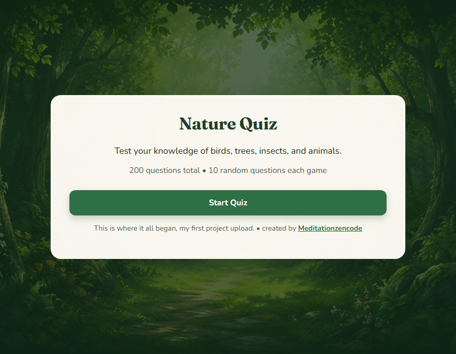
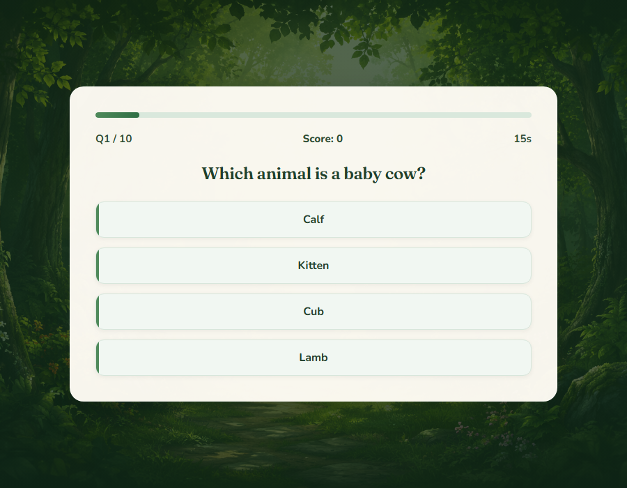
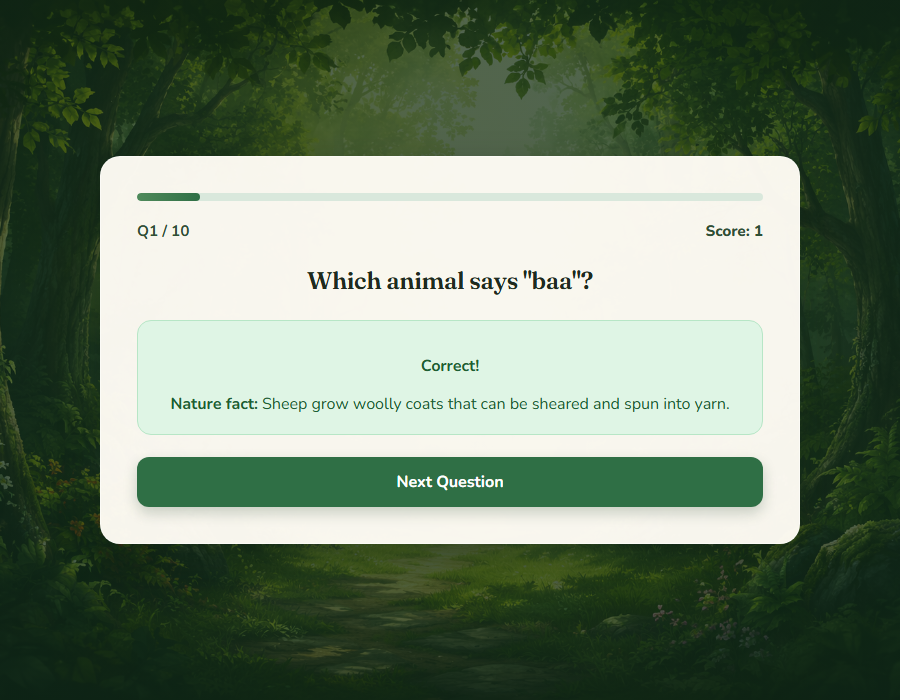
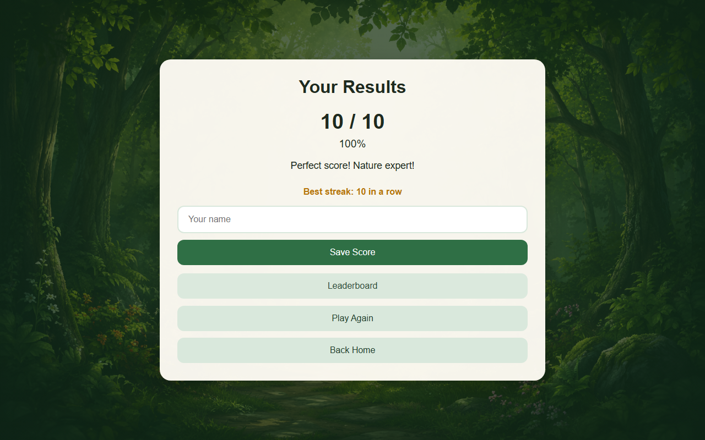
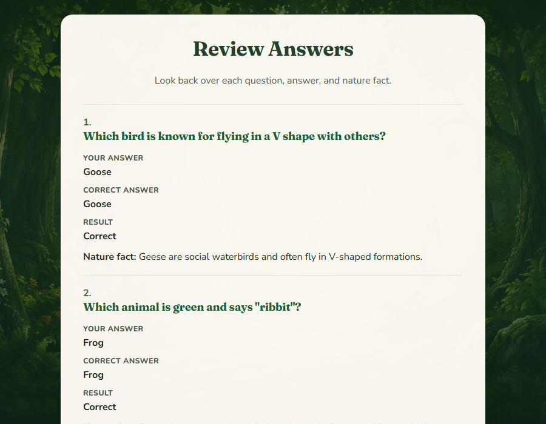
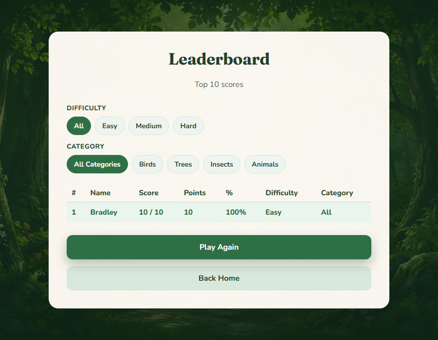
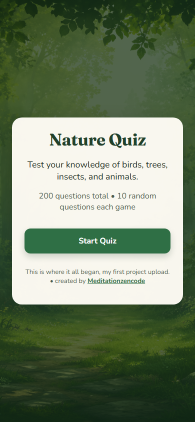

# Nature Quiz

[](https://github.com/Meditationzencode/nature-quiz/actions/workflows/test.yml)
[](LICENSE)
[](#future-improvements)

A deployed **Flask** web app with server-rendered pages, SQLite persistence, client-side timer logic, a pytest suite, and production-focused security features. Players answer 10 randomly selected questions from a bank of 200 nature questions, competing across three difficulty levels with a live countdown timer and a filterable leaderboard.

**Live demo:** [nature-quiz.onrender.com](https://nature-quiz.onrender.com)
**GitHub repo:** [github.com/Meditationzencode/nature-quiz](https://github.com/Meditationzencode/nature-quiz)

> **Note:** The first load may take 30–60 seconds while the server wakes up — this app is hosted on Render's free tier.

## Quick Summary

- Built with Python, Flask, Jinja2, SQLite, HTML, CSS, and JavaScript
- 200-question quiz bank across birds, trees, insects, and animals
- Randomized 10-question games with difficulty-based timers and scoring
- SQLite leaderboard with difficulty/category filters
- 40-test pytest suite covering routes, validation, CSRF, headers, and quiz logic
- Deployed on Render with gunicorn

## Demo


## Screenshots

### Home Page


### Quiz Question


### Answer Feedback


### Results Page


### Review Answers


### Leaderboard


### Mobile View


## Overview

Nature Quiz is a server-side web application built with Flask. Each game randomly selects 10 questions from a 200-question bank across four categories — birds, trees, insects, and animals. Difficulty controls both the countdown timer and points earned per correct answer, so harder games score higher on the leaderboard.

Questions are stored as Python lists in `questions.py` rather than a JSON file or database. They are static, read-only content that ships with the app, so external storage would add I/O and parsing complexity for no functional benefit. The leaderboard, which actually mutates as people play, is the part that lives in SQLite.

The project was built to develop practical Python and Flask skills: routing, Jinja2 templates, session-based state management, SQLite persistence, input validation, and a 40-test pytest suite.

## Engineering Highlights

- Built a session-based quiz flow with guarded routes so users can't skip steps or jump straight to results.
- Defended every form with server-side input whitelisting and hand-rolled CSRF protection.
- Added a 40-test pytest suite covering routes, quiz logic, validation, security headers, and edge cases.
- Deployed with gunicorn on Render and documented production limitations honestly rather than hiding them.

## Flow

```text
Difficulty → Category → Quiz Session → Feedback → Results → Leaderboard
```

## Features

- 200 nature-themed multiple-choice questions across four categories
- Three difficulty levels with weighted scoring:
  - Easy — 15 seconds per question, 1 point per correct answer
  - Medium — 10 seconds per question, 2 points per correct answer
  - Hard — 5 seconds per question, 3 points per correct answer
- Live countdown timer with automatic time-out handling
- Answer shuffled on every game so the correct choice is never always first
- Streak counter tracking consecutive correct answers
- Instant feedback after each answer with the correct answer and a nature fact
- Full answer review page after each game
- Results summary showing score, percentage, points, difficulty, category, and best streak
- Score saved to a SQLite leaderboard filterable by difficulty and category
- Duplicate score-save prevention via session flag
- All user input validated server-side before processing
- CSRF tokens on every form, plus hardened session cookies (HttpOnly, SameSite=Lax, Secure in production)
- Security response headers (HSTS in production, X-Content-Type-Options, X-Frame-Options, Referrer-Policy)
- `/healthz` liveness endpoint with a DB ping, plus a per-request correlation ID surfaced in logs and as `X-Request-ID`
- Custom 404 and 500 error pages
- Responsive layout for desktop and mobile

## Tech Stack

| Layer | Technology |
|---|---|
| Backend | Python, Flask |
| Templates | Jinja2 |
| Database | SQLite (sqlite3, WAL mode) |
| Frontend | HTML, CSS, JavaScript |
| Testing | pytest (40 tests) |
| Deployment | Render (gunicorn WSGI) |

## Project Structure

```text
nature-quiz/
├── app.py              # Routes, session logic, DB access
├── facts.py            # Nature fact lookup for answer feedback
├── questions.py        # 200 question bank (birds, trees, insects, animals)
├── take_screenshots.py # Playwright screenshot automation
├── requirements.txt
├── requirements-dev.txt
├── Procfile
├── runtime.txt
├── static/
│   ├── style.css
│   ├── main.js
│   ├── favicon.svg
│   └── images/
├── templates/
│   ├── layout.html
│   ├── index.html
│   ├── difficulty.html
│   ├── category.html
│   ├── quiz.html
│   ├── result.html
│   ├── review.html
│   ├── leaderboard.html
│   ├── 404.html
│   └── 500.html
├── tests/
│   ├── conftest.py
│   ├── helpers.py
│   ├── test_routes.py
│   └── test_questions.py
└── .github/
    └── workflows/
        └── test.yml
```

## How It Works

1. The user picks a difficulty level and a question category.
2. The app randomly selects 10 questions and shuffles the answer choices.
3. One question is shown at a time with a live countdown timer.
4. Selecting an answer or running out of time shows feedback with the correct answer and a nature fact.
5. After 10 questions the results page shows the full score breakdown.
6. The user can review every answer, save their score, or play again.
7. The leaderboard ranks scores by points, filterable by difficulty and category.

## Installation

```bash
git clone https://github.com/Meditationzencode/nature-quiz.git
cd nature-quiz
```

**Windows:**

```bash
py -3 -m venv .venv
.venv\Scripts\activate
```

**Mac/Linux:**

```bash
python3 -m venv .venv
source .venv/bin/activate
```

```bash
pip install -r requirements-dev.txt   # local dev (includes pytest)
# Production only:
# pip install -r requirements.txt
```

## Run Locally

```bash
python -m flask --app app run --debug
```

Then open `http://127.0.0.1:5000`

## Environment Variables

For local development, create a `.env` file in the project root:

```env
SECRET_KEY=your-secret-key-here
```

For production deployment, set these on your hosting platform:

| Variable | Required | Purpose |
|---|---|---|
| `SECRET_KEY` | Yes | Session-cookie signing key. Generate with `python -c "import secrets; print(secrets.token_hex(32))"` |
| `FLASK_ENV` | Yes (prod) | Set to `production` to enable strict secret enforcement, `Secure` cookies, and HSTS |
| `DATABASE_PATH` | No | Override the SQLite file location (defaults to `scores.db` in the project root) |

Never commit `.env` to version control.

## Testing

```bash
pytest tests/ -v
```

40 tests covering:

- All pages load with correct status codes
- Invalid difficulty, category, and spoofed answer inputs are rejected
- Timer timeout records the correct answer and resets the streak
- Double-submit guard prevents duplicate answers and duplicate score saves
- Protected routes redirect correctly when session is missing
- Leaderboard sorts by points and filters correctly by difficulty and category
- CSRF middleware rejects POSTs without a valid token and accepts them with one
- `/healthz`, security response headers, request-ID echo, and HSTS gating all behave as configured
- All 200 questions in every category have valid structure, four unique choices, and answers that match their choices

A GitHub Actions workflow (`.github/workflows/test.yml`) runs the full pytest suite on every push and pull request to `main`.

## Known Limitations

These are deliberate trade-offs for a portfolio project, documented up front:

- **Leaderboard is not durable in production.** Scores live in a local SQLite file (`scores.db`). On Render's free tier the file system resets on redeploy and after inactivity spin-downs, so the leaderboard does not persist permanently. For a durable leaderboard, swap `sqlite3` for a hosted database such as Supabase or Render PostgreSQL.
- **Cold starts.** The free tier spins the server down when idle, so the first request after inactivity can take 30–60 seconds.
- **No user accounts.** Scores are tied to a session, not a player identity, so history can't be tracked across devices or sessions.

## Skills Demonstrated

- **Flask routing and request handling** — GET/POST routes with session guards and redirect flows
- **Server-side input validation** — all user input checked against whitelists before processing
- **Session-based state management** — quiz progress, streak, and score tracked entirely server-side
- **SQLite database** — schema creation, parameterised queries, on-the-fly scoring, and a lightweight compatibility update for older score rows
- **Jinja2 templating** — shared layout, conditional rendering, and template inheritance
- **JavaScript timer** — client-side countdown that auto-submits a form and cancels on answer
- **Responsive CSS** — mobile-first layout using grid and flexbox
- **pytest test suite** — 40 tests across routes, data validation, CSRF, security headers, and business logic
- **Production security posture** — required `SECRET_KEY` (raises on missing), hand-rolled CSRF, hardened session cookies, security response headers (HSTS, nosniff, X-Frame-Options, Referrer-Policy), parameterised SQL, server-side input whitelisting
- **Production readiness** — `/healthz` endpoint with DB ping, request-ID correlation in logs and headers, structured logging, gunicorn worker tuning, pinned Python and dependencies, SQLite WAL mode for safer concurrency

## What I Learned

- How to structure a Flask application and separate concerns across routes, templates, and data files
- How session data works as a server-side store and why it suits quiz state
- How to write tests that use a real in-memory database rather than mocks
- How to think about security at each input boundary — form fields, query strings, and session values
- How to iterate: starting with something that worked, then improving correctness, then cleaning up

> I keep this project in my portfolio as a baseline Flask application that demonstrates routing, sessions, validation, testing, deployment, and production-readiness practices.

## Future Improvements

- Persistent leaderboard using a hosted database (Supabase or Render PostgreSQL)
- Admin page for adding and editing questions, protected with authentication
- User accounts so players can track their score history over time

## Author

**Bradley**

GitHub: [github.com/Meditationzencode](https://github.com/Meditationzencode)
